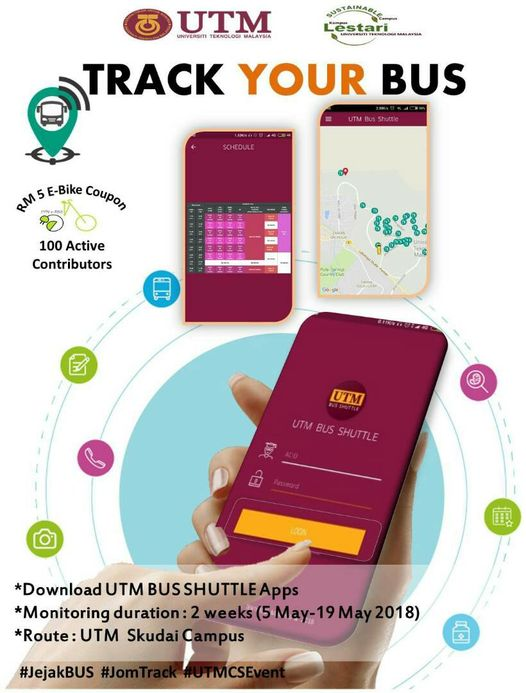

 

    <h1>UTM Bus Tracker</h1>

 

A project of bus tracking system for students in Universiti Teknologi Malaysia. This project was propose to UTM with collaboration of UTM Lestari as coordinator. The project was a success with over 1000+ download on google play.

- [UTM News about Bus Tracker](https://www.facebook.com/571489969596705/posts/1742771772468513/)

## Screenshot

## Tech use
-   Android Studio - The apps
-   Linux server (Nginx, PHP) - Server side